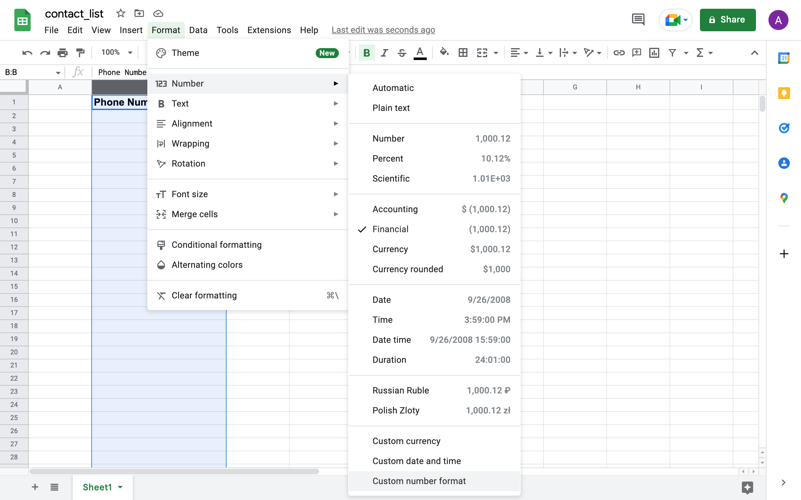

## Step 1: Download python 3 if it's not already installed on your machine.

to check if python 3 is installed on your machine, open a terminal window if you're on Linux/Mac or a windows console if you're on Windows, then type the following.

For Linux/Mac:

    python3 --version
    
For Windows:

    python --version

If the terminal doesn't output a version number, you will have to install a recent version of python 3. Open a new browser tab, navigate to **https://www.python.org/** and click the download button from the navigation bar, depending on your operating system, here's an example:

## Step 2: Install the necessary python modules for the script to work.

Once the previous installation is finished, you should have python, as well as the **Package Installer for Python (pip)** installed on your computer, we'll need to use pip in order to install different modules that the script relies on to work properly, to make sure pip's installed, run the following command, just like in step 1.

For Linux/Mac:

    pip3 --version
    
For Windows:

    pip --version

Again, if the terminal doesn't output a version number, we'll have to install pip manually. If this happens, run the following command to install it.

For Linux/Mac:

    python3 -m ensurepip --upgrade
    
For Windows:

    py -m ensurepip --upgrade

We are now ready to install the necessary modules, the module names are stored in the requirements.txt file within this repository.
First, let's start by downloading the source files for the dispatcher, navigate to the top of the page, click the "code" button, then the "download ZIP" button, here's an example:

Double-click the ZIP file in order to unzip it and view the project folder, next we'll have to navigate to the folder within the console in order to access the "requirements.txt" file. On a Mac, right-click the folder, then click "New Terminal at Folder" (See example below), On windows, follow one of the 3 methods seen in the article at **https://www.wikihow.com/Open-a-Folder-in-Cmd** (method 1 is the simplest):

We can now finally use "requirements.txt" to install the necessary modules for the script to work, after you complete the previous step, type the following into the terminal:

For Linux/Mac:

    pip3 install -r requirements.txt
    
For Windows:

    pip install -r requirements.txt

## Step 3: Add the message and the phone numbers you wish to sent it to.

The dispatcher should now be set up to work properly, let's add the message we wish to send. Open the "message_body.txt" file that's in the downloaded folder, delete the placeholder **"COPY YOUR MESSAGE TO THIS FILE & SAVE IT"** and copy the text you would like to send instead, save it, then close the file.

Now, let's add the phone numbers we wish to contact, whatsapp-messaging-dispatcher uses spreadsheets to read phone numbers data, keep track of the numbers that were already contacted, and numbers that should be skipped over, Below is an example of how to use it.

Let's first create a spreadsheet file, you have to name the file **"contact_list.xlsx"**, otherwise the dispatcher won't recognize it, you can use any spreadsheet software you like, I'll be using Google Sheets, as it is free and accessible to everyone:

We'll fill in our phone numbers in the B column, starting at **the second row**,  this is necessary, the dispatcher will not read the phone number on the first row, you can use that row to label the column for better readability optionally, you can type a **lowercase** "x" in the E column in front of a phone number, if you want the dispatcher to skip it, i.e. if you want to keep the original spreadsheet intact and not delete anything, the reason the spreadsheet should be formatted this way, is so the spreadsheets are compliant with the formatting of the sheets created by the "WA - Download Group Phone Number" chrome extension, more on that in a minute. Here's an example: 

The cells need to contain the international phone number version in order for whatsapp to process them, this includes the prefix with a plus sign; unfortunately, spreadsheet software treats "+" signs as a special symbol and will not output them to the sheet by default, in order for us to be able to add "+" signs before the phone number, we need to add special formatting to number cells. In the google sheet that you created, navigate to the **"format"** menu, then **"Custom number format"**, enter the following to the input field: **"+0;-0;0"**, then click on **"Apply"**, it should now work! Here's an example:

Alternatively, you can use the "WA - Download Group Phone Number" chrome extension", to download all the contact numbers from a whatsapp group and save them as a spreadsheet, the numbers should already be properly formatted and on the B column so you don't have to worry about that. Just like our custom sheets, you can also type a **lowercase** "x" in the E column in front of a phone number in the outputted sheet, if you want the dispatcher to skip it, Here's a tutorial on how to use the chrome extension from its creator:
⇒ **https://www.youtube.com/watch?v=5MZ04xhapNw&ab_channel=VeeraG**

The dispatcher has an extra feature, you can add as many phone number sheets in the archive folder of the project (the numbers should still be formatted as international version, in the B column, starting at the second row), and the dispatcher will skip over all the numbers that are in those sheets, this is especially useful if, for example, you have contacted members of one whatsapp group, and you would like to send an identical message to another group that also has some members from the previous group, all you have to do is add the numbers sheet from the first group to the archive folder and those phone numbers will be skipped when the dispatcher parses the numbers of the second group.

## Step 4: Start the dispatcher.

After saving **"contact_list.xlsx"** inside the root of our downloaded folder in step 2, we are ready to run the dispatcher's script. 

First, make sure that you have chrome installed, then, make sure you are logged in to **Whatsapp Web**, head to **https://web.whatsapp.com/** and follow the log-in procedure if you're not.

then, in your terminal/console, navigate to the downloaded folder directory, just like in Step 2, then run the following command.

For Linux/Mac:

    python3 whatsappDisptacher.py
    
For Windows:

    python whatsappDisptacher.py

The dispatcher should start working, you should see your browser open on its own, head to the **Whatsapp Web** app, send the message in "message_body.txt", close the tab, then do that over and over until it goes through all the un-skipped numbers in **"contact_list.xlsx"**, If you would like to **stop** the process, you can do this at anytime by heading back to the terminal console, and pressing **"CTRL+C"**.

If you experience any bugs, feel free to send me an email at hacksek101@gmail.com, I'm always looking for ways to improve this project!

